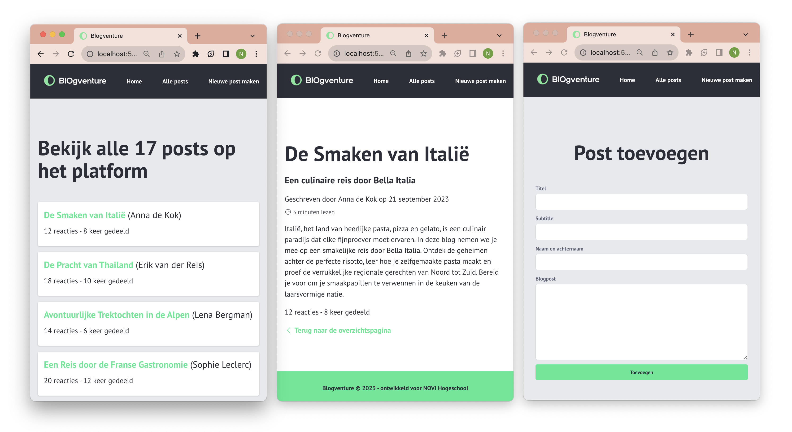
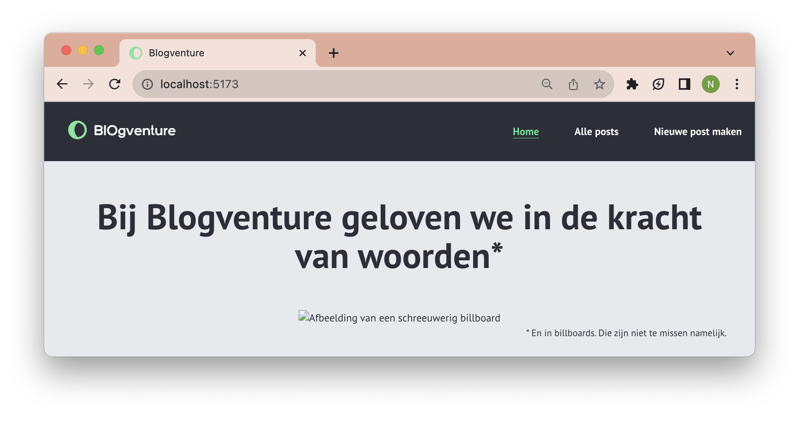

# Opdrachtbeschrijving

1. [Inleiding](#inleiding)
2. [Applicatie starten](#applicatie-starten)
3. [Opdracht I: Routing](#opdracht-i---routing)
   1. [Pagina's](#11-paginas)
   2. [Naviatie](#12-navigatie)
   3. [Dynamic routing](#13-dynamic-routing)
4. [Opdracht II: Data](#opdracht-ii---gebruik-van-data)
   1. [Overzichtspagina](#21-overzichtspagina)
   2. [Blogpost Detailpagina](#22-blogpost-detail-pagina)
5. [Opdracht III: Formulier](#opdracht-iii---formulier--doorlinken)
   1. [Formulier bouwen](#31-formulier-bouwen)
   2. [Data verzamelen](#32-data-verzamelen)
   3. [Doorlinken](#33-doorlinken)
6. [Hints & Houvast](#hints--extra-houvast)
7. [Bonus](#bonus)

## Inleiding

Het fruitmand-bezorgd-bedrijf van Freek en Bernard heeft de pandemie helaas niet overleefd. Daarom hebben ze nu een
nieuw idee: ze willen een blogplatform opzetten en rijk worden met affiliate marketing. Tenminste, dat is het plan. Het
enige wat ze nodig hebben, is zo'n platform... Of je ze misschien nog één keer wil helpen?

Voor jou natuurlijk geen probleem. Inmiddels heb je geleerd hoe je met routing, state, formulieren, componenten en
helper-functies moet werken. Al deze concepten kun je in deze opdracht mooi toepassen, want je wilde nog wat extra
oefenen met het opzetten van routingsstructuren en werken met dynamic parameters. Gelukkig hebben Freek en Bernard dit
keer wél een designer ingehuurd en een normaal bedrijfslogo laten maken. Alle varianten van dit logo vind je in
de `assets`-map. Je bent vrij om de styling uit het [voorbeeld](https://coolors.co/38e991-2c2f39-50535c-e8e9ed-ffebc6)
na te bootsen, of hier je eigen draai aan te geven.



Het project is opgezet met [Vite](https://vitejs.dev/) (React versie 18.2.0).

## Applicatie starten

Als je het project gecloned hebt naar jouw locale machine, installeer je eerst de `node_modules` door het volgende
commando in de terminal te runnen:

```shell
npm install
```

Wanneer dit klaar is, kun je de applicatie starten met behulp van:

```shell
npm run dev
```

of gebruik de WebStorm knop (npm run dev). Open http://localhost:5173 om de pagina in de browser te bekijken. Begin met
het maken van wijzigingen in `src/App.jsx`: elke keer als je een bestand opslaat, zullen de wijzigingen te zien zijn op
de webpagina.

## Opdracht I - Routing

### 1.1 Pagina's

De blog-applicatie heeft op dit moment nog geen routing-structuur en ook geen pagina's. Tijd om daar verandering in te
brengen! Maak zelf 4 pagina-componenten aan met een passende routing-structuur:

* Home pagina
* Nieuwe post pagina (om een nieuwe blog te starten)
* Overzichtspagina (om alle blogs te bekijken)
* Een 404-pagina (om foute url's af te vangen)
  Uiteraard test je goed of alles werkt, door handmatig de url in de adresbalk te veranderen. _Tip:_ zet ook direct de
  pagina-naam als titel bovenaan iedere pagina, zodat je kunt zien wat er gebeurt.

### 1.2 Navigatie


Naast het feit dat er content op de pagina's moet komen te staan - hier komen we in opdracht 2 op terug - zul je ook
moeten zorgen voor een goed werkende menu-balk met daarin de links naar:

* 'Home'
* 'Alle posts'
* 'Nieuwe post'

* Deze menu-balk moet altijd bovenaan iedere pagina staan. Zorg ervoor dat het in het menu zichtbaar is wat de actieve
  pagina is.

### 1.3 Dynamic routing

We zullen straks een hoop blogposts willen weergeven aan onze gebruikers. Deze hebben echter allemaal hetzelfde format,
dus willen we hier één pagina voor gebruiken. Maak een nieuw pagina-component voor de Blogpost detailpagina. 

Zorg ervoor dat deze pagina alleen te bereiken is via een dynamische url, zoals bijvoorbeeld: `/posts/234`. Om te controleren of
jouw implementatie werkt, zorg je dat de dynamische parameter door de pagina wordt uitgelezen en als titel wordt
weergegeven op de pagina. Test of dit werkt door het volgende te doen:

* Als je naar `/posts/fslkjfksdjf` navigeert, staat er dan _fslkjfksdjf_ op je pagina?
* Als je naar `/posts/234` gaat, staat er dan _234_ op de pagina?

De blog detailpagina is geen onderdeel van de menu-balk.

## Opdracht II - Gebruik van data

Tijd om de pagina's te vullen met content! Gezien dit een blogplatform is, gaan we de content natuurlijk niet
_hardcoded_ op de pagina zetten. Binnenkort leer je hoe je die content kunt ophalen van een externe bron, maar voor nu
maken we nog even gebruik van een JSON-bestand vol _ready-made_ blogposts. Deze vind je in de map `constants`. _Tip:_
lukt het niet met importeren? Spiek dan even onderaan de opdrachtbeschrijving.

### 2.1 Overzichtspagina

Deze pagina moet de totale hoeveelheid posts op het platform weergeven (een nummeriek getal) en een lijst van alle
blogs. Deze geef je weer in het volgende format:

```
De Smaken van Italië (Anna de Kok)
12 reacties - 8 keer gedeeld
```

De titels zijn links die de gebruiker **doorlinkt** naar de detailpagina van deze post.

### 2.2 Blogpost detail pagina

Om de juiste informatie te laten zien, zul je eerst de corresponderende blogpost uit `data.json` moeten halen. _Tip:_
krijg je telkens `undefined` terug? Spiek dan eens bij de hints.

Wanneer je de juiste gegevens bij de hand hebt, wil je die op de volgende manier op de pagina weergeven:

>
> ### De Smaken van Italië (5 minuten)
> #### Een culinaire reis door Bella Italia
> Geschreven door Anna de kok op 21 september 2023
>
> Italië, het land van heerlijke pasta, pizza en gelato, is een culinair paradijs dat elke fijnproever moet ervaren. In
> deze blog nemen we je mee op een smakelijke reis door Bella Italia. Ontdek de geheimen achter de perfecte risotto, leer
> hoe je zelfgemaakte pasta maakt en proef de verrukkelijke regionale gerechten van Noord tot Zuid. Bereid je voor om je
> smaakpapillen te verwennen in de keuken van de laarsvormige natie.
>
> 12 reacties - 8 keer gedeeld
>
> Terug naar de overzichtspagina

Onderaan de pagina staat een link die de gebruiker terugstuurt naar de overzichtspagina.

Om de datum van _"2023-09-20T11:45:00Z"_ naar _"21 september 2023"_ te converteren maak je natuurlijk een mooie
helperfunctie. Weet je niet meer hoe je datums moet formatteren? Duik dan weer eens in de cursus JavaScript Basics bij
het hoofdstuk over methodes en lees je in over het _Date-object_.

## Opdracht III - Formulier & Doorlinken

We willen de gebruiker op ten duur in staat zellen om _zelf_ nieuwe blogposts toe te kunnen voegen aan ons platform.
Hoewel we nog geen database of externe bron hebben waarin we die kunnen opslaan, kunnen we er wel alvast voor zorgen dat
we die informatie kunnen _verzamelen_. Je mag het formulier bouwen op de standaard manier (controlled components met
state) of met React Hook Form.

### 3.1 Formulier bouwen

Bouw een formulier met de volgende velden:

* Titel
* Subtitel
* Auteur
* Bericht
  Alle velden moeten verplicht worden ingevuld. De blogpost moet minimaal 300 en maximaal 2000 karakters lang zijn. Als
  er niet aan deze voorwaarden is voldaan, kan de post niet worden verzonden.

### 3.2 Data verzamelen

Wanneer de gebruiker op 'verzenden' drukt, worden deze gegevens in de console gelogd. Deze informatie verreik je
vervolgens **zelf** met:

* De hoeveelheid `shares` en `comments` (allebei `0`)
* Een `created` property met daarin
  een [ISO-timestamp](https://developer.mozilla.org/en-US/docs/Web/JavaScript/Reference/Global_Objects/Date/toISOString)
  van het moment dat de gebruiker op de knop heeft drukt
* De `readTime` in minuten. De leestijd bereken je zelf op basis van het aantal ingevulde woorden: een gemiddelde
  gebruiker leest 100 woorden in 0.3 minuten. Zorg dat je decimalen altijd afrond naar hele getallen. Zei iemand daar...
  helperfunctie?

Een ingevuld formulier resulteerd in het volgende voorbeeld-resultaat:

```json
  {
  "title": "Wat gebruiker heeft ingevuld",
  "subtitle": "Wat gebruiker heeft ingevuld",
  "content": "Wat gebruiker heeft ingevuld, in dit geval minder dan 100 woorden",
  "author": "Voornaam achternaam",
  "created": "2023-09-21T09:30:00Z",
  "readTime": 1,
  "comments": 0,
  "shares": 0
}
```

### 3.3 Doorlinken

Wanneer de gebruiker alle juiste gegevens heeft ingevuld en we deze informatie in de console hebben gelogd, willen we de
gebruiker automatisch doorsturen naar de overzichtspagina. Dat is natuurlijk niet zo gebruiksvriendelijk zonder eerst
een succesmelding te tonen, maar daar maken we ons later druk om!

## Hints & Extra houvast

### Het lukt niet om mijn JSON bestand te importeren

Je kunt het JSON-bestand op de volgende manier importeren en gebruiken:

```jsx
import posts from '../constants/data.json';

function BlogPost() {
    console.log(posts);

    return (
        <></>
    );
}
```

### Ik kan geen enkele blogpost vinden

Het is belangrijk om op te merken dat de `id`'s van alle blogposts zijn opgeslagen als _nummerieke getallen_, in
tegenstelling tot de dynamic parameter uit de url. Dynamic parameters zijn altijd van type _string_. Wanneer je beide
waardes wil vergelijken, zul je één van de twee eerst moeten omzetten naar een _string_ of _number_.

## Bonus

1. **Componenten:** kijk goed naar je applicatie en benoem welke elementen er vaker terugkomen. Maak hier herbruikbare
   componenten van, door gebruik te maken van properties en callback properties. Denk hierbij aan list-items, buttons,
   input-velden en andere kleine groepjes elementen.
2. **Iconen:** Wil je ook gebruik maken van icoontjes, zoals je in de screenshots van het voorbeeld hebt gezien? Dat kan
   super gemakkelijk met behulp van [Phosphor Icons](https://phosphoricons.com/). Zij hebben een speciale react-package
   die je in jouw project kunt installeren om er gebruik van te maken. Je
   leest [hier](https://www.npmjs.com/package/@phosphor-icons/react) hoe je deze installeert en gebruikt.
3. **Styling:** richt jouw project netjes in door alle overkoepelende styling in `index.css` te declareren. Denk hierbij
   aan:
    * Een CSS reset;
    * Font-declaraties en globale typografie toewijzingen voor titels, buttons en invoervelden;
    * CSS-variabelen voor de kleuren die je wil gebruiken;
    * Globale css-classes zoals de `inner-container` en `outer-container`;